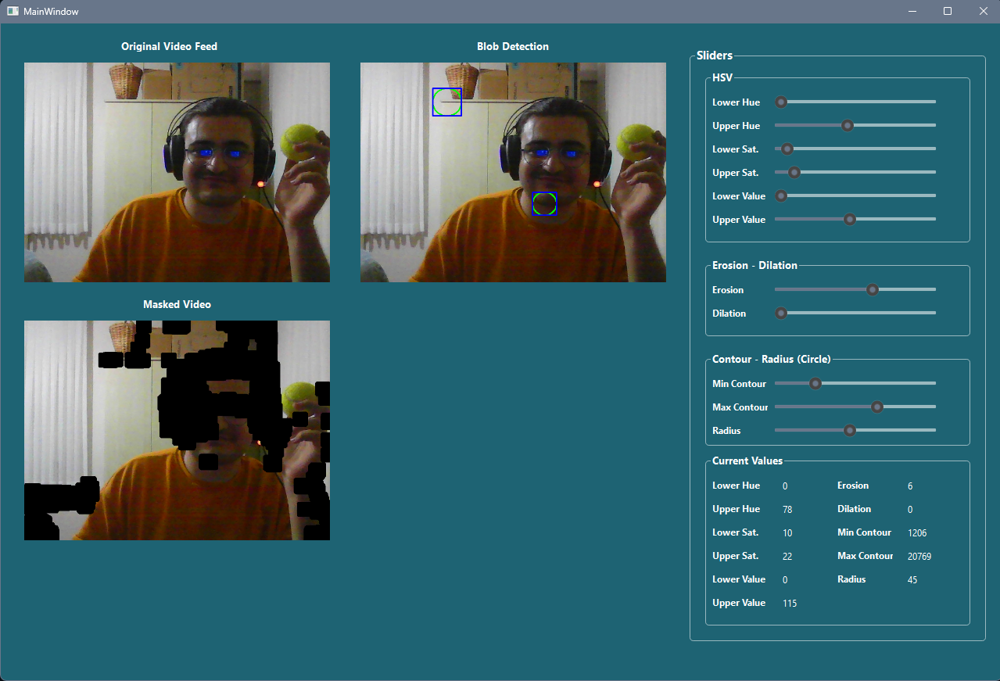
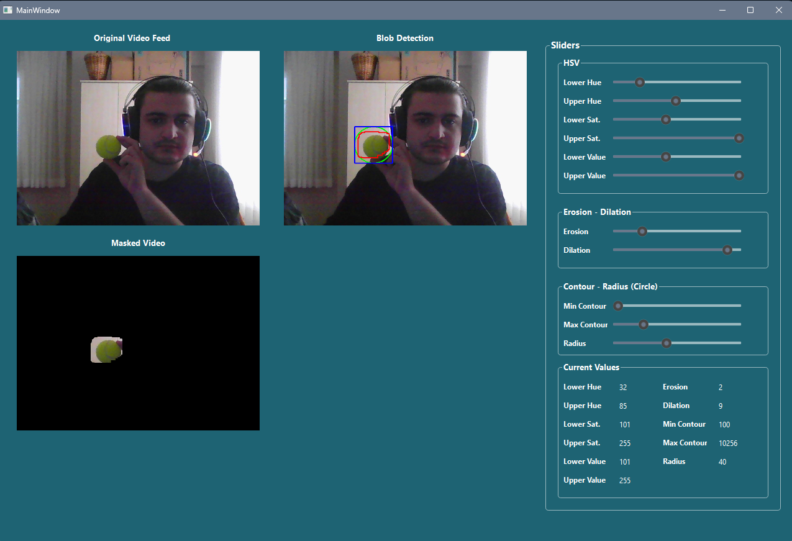
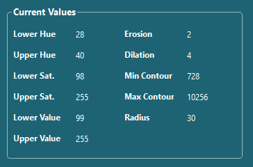

# OpenCV Blob Detection GUI

## Overview
Simple PyQT (Pyside) GUI to be used for blob detection. Has different sliders for value adjustments. 
I created this just because I wanted to learn more about blob detection and not hard-code and restart the script every single time.
This simple GUI enables me to try/test different things without needing to be change every value by hand.

## Features
- Real-Time Video Processing: Captures video frames from a webcam and processes them to detect blobs.
- HSV Color Filtering: Applies HSV color space transformation to isolate blobs based on their color.
- Morphological Operations: Uses erosion and dilation to clean up the mask and improve detection accuracy.
- Contour Detection: Finds and filters contours to identify the tennis ball based on size and shape.
- Blob Detection: Draws circles and bounding boxes around detected tennis balls for visualization.
- Dynamic Value Adjustments: Allows real-time adjustments of values to fine-tune detection.
- Threading: Uses QThread for video capturing and processing to not freeze up value adjustments or main gui.


## Showcase

- First day tests, detection fine tuning is not great for now. Will be looking into algorithms and what paramateres actually do.


- Second day tests, can fine tune to detect a tennis ball. Might add a table into the blank place for some pre-determined values for some items (tennisball, balloons etc.)


- Second day tests, roughly enough values for tennisballs. LIGHTING OF THE ROOM/CAMERA VIEW is pretty important for good detection!!!

## Requirements
- For requirements install requirements.txt
```
pip install -r requirements.txt
```
